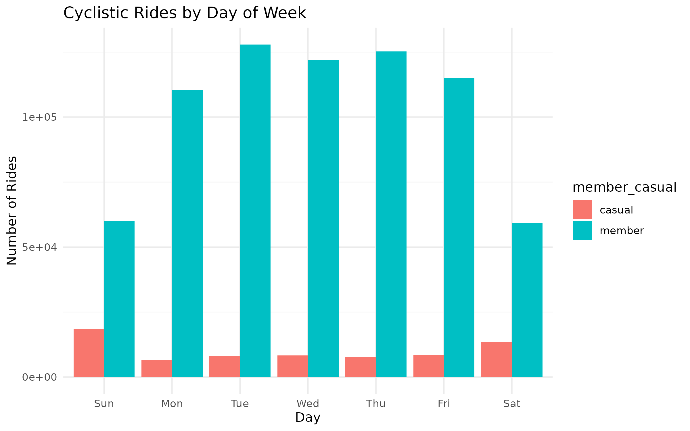
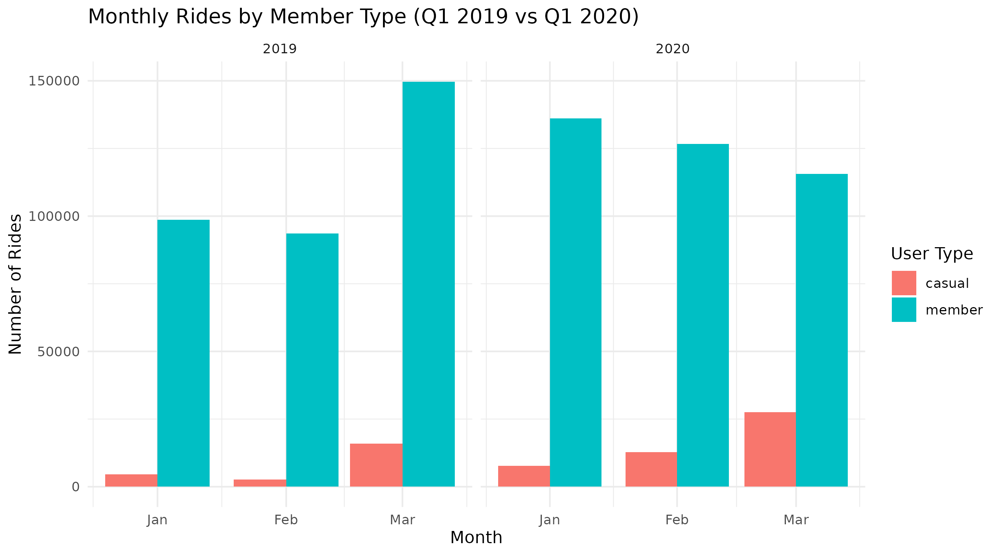

# Analyze Phase  

**Business Question:** How do annual members and casual riders use Cyclistic bikes differently?  

---

## 1️⃣ Ride Volume by Day of Week
  
**Insights:**  
- **Members** ride heavily during weekdays (Mon–Fri), suggesting commuting or regular travel.  
- **Casual riders** ride far more on weekends, indicating leisure and recreational trips.  
- Members consistently take more rides overall compared to casual riders.

---

## 2️⃣ Average Ride Length by Day
  
**Insights:**  
- **Casual riders** take longer rides across all days, with peak ride lengths on weekends (~35+ minutes).  
- **Members** average shorter, consistent ride lengths (~11–13 minutes), aligned with quick commutes.

---

## 3️⃣ Monthly Rides Year-over-Year
  
**Insights:**  
- In both Q1 2019 and Q1 2020, members maintained higher total ride counts.  
- Casual rides grew more sharply in early 2020, especially in March.  
- This growth could be leveraged for membership conversion campaigns before peak season.

---

## 4️⃣ Year-over-Year Weekday Patterns
  
**Insights:**  
- Weekday riding patterns are stable year-over-year for both groups.  
- Weekend ridership for casual riders showed stronger growth from 2019 to 2020, indicating increasing leisure demand.

---

## 5️⃣ Quick Summary Table
| Metric                      |  Casual | Members |
|:----------------------------|--------:|--------:|
| **Total rides** (Q1 2019+20) |  71,138 | 720,126 |
| **Avg ride length** (min)    |   36.5  |   11.4  |
| **Median ride length** (min) |   22.0  |    8.5  |
| **Weekend share of rides**   |  45.0%  |  16.6%  |

**Highlights:**  
- Members ride more often but for shorter durations.  
- Casual riders take fewer trips but spend more time riding, especially on weekends.

---

## 📌 Interpretation
1. **Members** display consistent weekday usage and shorter trips, likely driven by commuting needs.  
2. **Casual riders** favor weekends and take longer trips, showing a recreational focus.  
3. Casual ride growth in early 2020 highlights an opportunity to capture leisure riders with targeted promotions before peak season.
