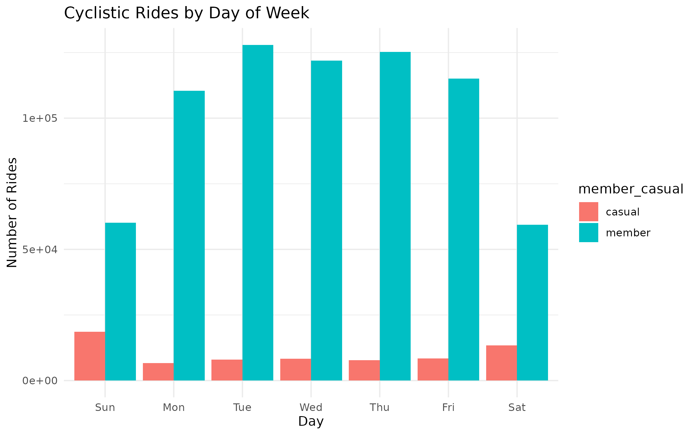
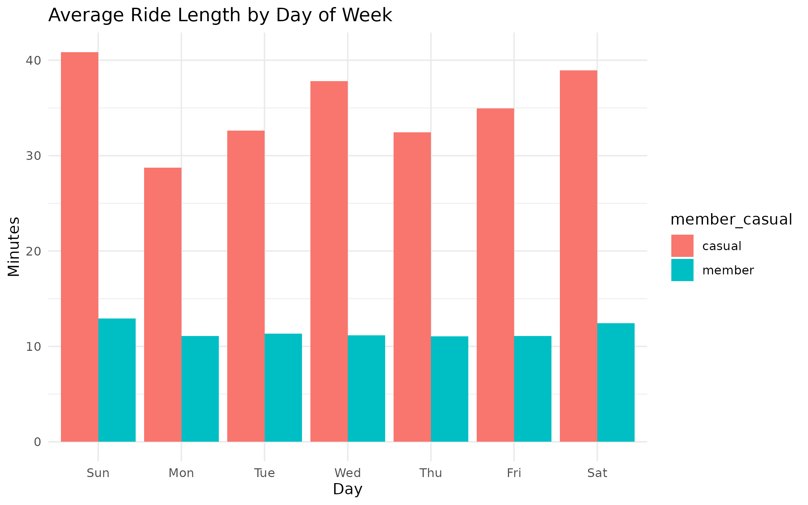
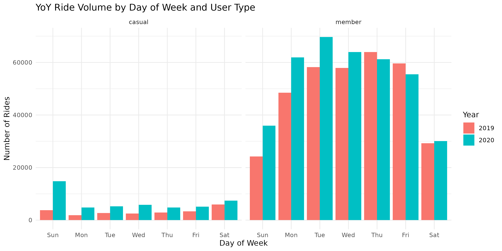

# Cyclistic_CaseStudy
Data analysis of Q1 2019 and Q1 2020 Divvy bike-share trips to identify differences in usage between annual members and casual riders. Conducted in R (Posit Cloud) using tidyverse, lubridate, and ggplot2. Includes data cleaning, year-over-year trend analysis, visualizations, and marketing recommendations to convert casual riders into members.

## Business Question
**How do annual members and casual riders use Cyclistic bikes differently?**

---

## Key Findings

### 1. Ride Volume by Day of Week

- **Members** ride heavily during weekdays (Mon–Fri), suggesting commuting or regular travel.
- **Casual riders** ride far more on weekends, indicating leisure and recreational trips.
- Members consistently take more rides overall compared to casuals.

---

### 2. Average Ride Length by Day

- **Casual riders** take longer rides across all days, with peak ride lengths on weekends (~35+ minutes).
- **Members** average shorter, consistent ride lengths (~11–13 minutes), aligned with quick commutes.

---

### 3. Monthly Rides Year-over-Year

- In **Q1 2019** and **Q1 2020**, members maintained higher total ride counts.
- Casual rides grew more sharply in early 2020, especially in March.
- Growth in casual rides could be leveraged for membership conversion campaigns.

---

### 4. Year-over-Year Weekday Patterns

- Weekday riding patterns are stable year-over-year for both groups.
- Weekend ridership for casuals showed stronger growth from 2019 to 2020, indicating leisure demand is increasing.

---

## Interpretation

1. **Members** display consistent weekday usage and shorter trips, likely driven by commuting needs.  
2. **Casual riders** favor weekends and take longer trips, showing a recreational focus.  
3. Casual ride growth in early 2020 highlights an opportunity to capture leisure riders with targeted promotions before peak season.

---

## Final Recommendations

Based on the analysis of Q1 2019 and Q1 2020 Cyclistic trip data, the following three recommendations are proposed to increase annual memberships:

---

### 1. Target High-Frequency Casual Riders with Cost-Saving Messaging
- Identify casual riders who take 3+ rides per month.
- Use targeted email campaigns and in-app notifications to show how much they could save annually with a membership.
- Include easy one-click membership sign-up links.

---

### 2. Convert Weekend Riders to Weekday Commuters
- Create “Weekend-to-Weekday Challenge” promotions where casuals earn free weekday rides after a certain number of weekend rides.
- Highlight benefits of weekday commuting via bike: convenience, speed, cost savings, environmental impact.
- Partner with local employers to offer discounted memberships to employees.

---

### 3. Launch Geo-Targeted Digital Ads in Leisure Hotspots
- Use location-based ads near popular weekend destinations and high-use docking stations.
- Promote on-the-spot membership discounts or bundle offers for families and friends.
- Run seasonal campaigns in spring/summer to capture riders at peak leisure times.

---

## Next Steps

1. **Pilot Campaigns**  
   Test targeted offers with a small group of high-frequency casual riders to measure conversion rates.

2. **Incorporate Weather and Event Data**  
   Integrate external data sources to refine timing of promotions and forecast seasonal demand.

3. **Measure Impact**  
   Track conversion metrics, ride frequency changes, and retention rates to evaluate campaign success and optimize further.

